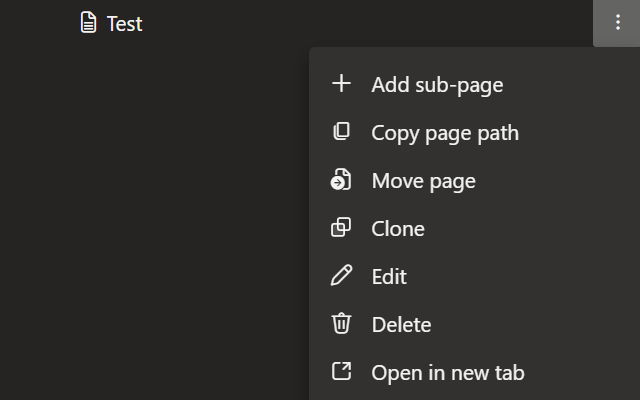
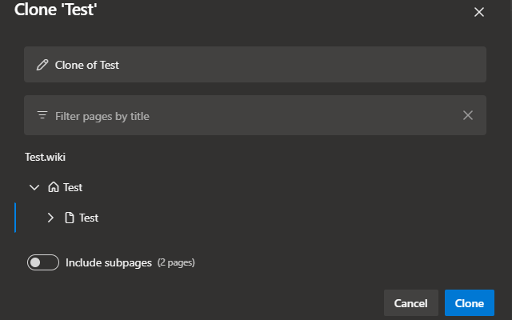

# Azure DevOps Wiki Clone Page

Adds a clone option to the Azure DevOps wiki page context menu.  
Makes cloning of wiki pages (and subpages) in Azure DevOps Wikis possible via a simple GUI.  

## Install

Get the extension on the Google Chrome Web Store:  
https://chromewebstore.google.com/detail/azure-devops-wiki-clone-p/ndfegibldghikdekddhaolpkdidmaklo

Get the extension on the Microsoft Edge Web Store:  
https://microsoftedge.microsoft.com/addons/detail/azure-devops-wiki-clone-p/aohjenfmceoijfcdgigfebcgmnfmiacj

Install it manually with the latest zip file from the [GitHub Releases page](https://github.com/Br3zzly/azure-devops-clone-wiki-page/releases/latest) by following this guide:  
https://developer.chrome.com/docs/extensions/get-started/tutorial/hello-world#load-unpacked
  

